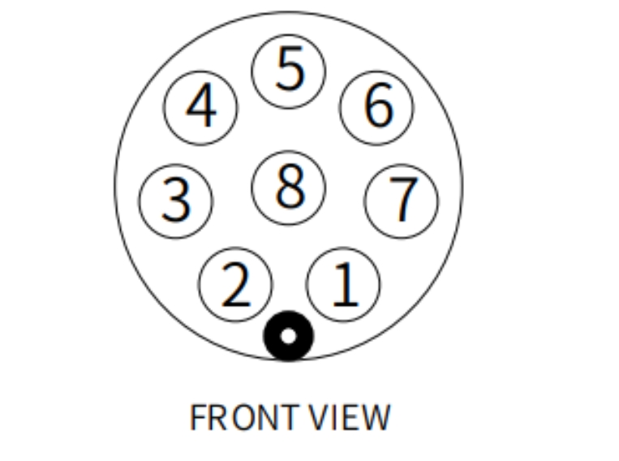
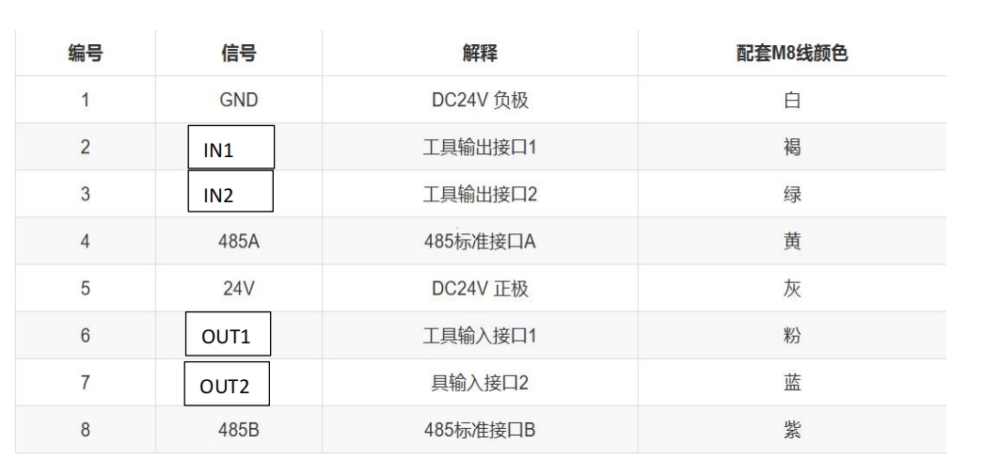
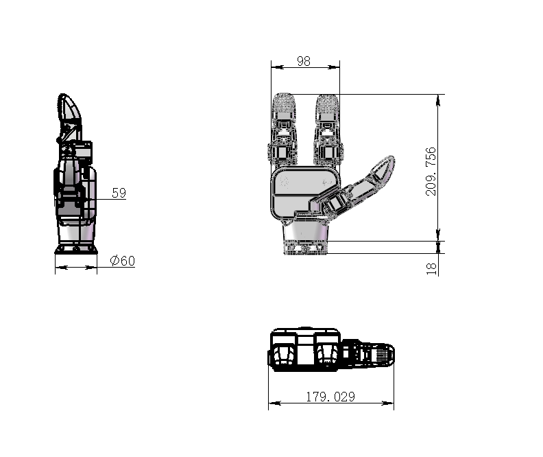

# 产品特性
## 1 产品规格参数
| 名称    | myGripper H100 三指灵巧手      |
| :----------- | :-------------------------------------- |
| 握持范围     | 0 - 130mm                                |
| 指尖数   | 3指，分别对应人手的：拇指 食指 无名指                                  |
| 使用寿命     | 10W次及以上                                    |
| 可活动关节     | 6个                                  |
| 电机类型   | 伺服舵机，支持电流、位置、速度控制                             |
| 重量         | 780g                               |
| 额定负载   | 500g                                  |
| 电源参数  | 24V2A                                 |
| 固定方法     | 螺丝固定                                |
| 使用环境要求 | 常温常压                                |
| 控制接口     | RS485控制                        |

**引脚线序说明**

编号1,5 连接GND与24V，编号2,3 为控制 IO 输入，编号6,7 为 IO 输出，编
号4,8为485 通信，是与灵巧手接收与发送指令

**注意事项**：

请根据线标区分线序，如出现线标丢失、脱落、遗忘等情况，请联系我
司工作人员，配合确定线序。如不联系我司工作人员，因接错线序，导致灵巧手
损坏，后果自负

## 2 主控制器规格参数表

| 名称    | ESP32     |
| :----------- | :-------------------------------------- |
| 核心参数     | 240MHz dual core. 600 DMIPS, 520KB SRAM. Wi-Fi, dual mode Bluetooth                               |
| Flash  | 4MB                                  |

## 3 结构参数

