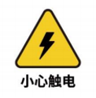

# 用户须知
## 1 简介
&emsp;&emsp;本章详细介绍了有关对大象机器人执行安装、维护和维修工作的人员的常规安全信息。请在搬运、安装和使用前，先充分阅读和理解本章节的内容与注意事项。

## 2 危险识别
&emsp;&emsp;协作机器人的安全性建立在正确配置和使用机器人的前提上。并且，即使遵守所有的安全指示，操作者所造成的伤害或损伤依然有可能发生。因此，了解机器人使用的安全隐患是非常重要的，有利于防患于未然。
&emsp;以下表 1-1~3 是使用机器人的情境下可能存在的常见安全隐患:

 <strong>表 1-1 危险级安全隐患</strong>

|
| 
| :--- |
| 1、机器人搬运过程中的错误操作导致的人身伤害或者机器人损伤。 |
| 2、未按要求固定机器人，例如螺钉缺少或螺钉未上紧、底座锁付能力不足以稳定支撑机器人进行高速运动等造成机器人倾倒导致人身伤害或者机器人损伤。 |
| 3、未进行机器人的正确安全功能配置，或者少安装了安全防护工具等，造成机器人安全功能未能发挥作用，从而引起危险。 |

 <strong>表 1-2 警告级安全隐患</strong>

|
| 
| :--- |
| 1、调试程序时请勿在机器人运动范围内逗留，不合适的安全配置可能无法避免可能造成人身伤害的碰撞。 |
| 2、机器人与其他设备连接可能引发新的危险，需要重新进行全面的风险评估。 |
| 3、因工作环境中的其他设备或者机器人末端执行器等尖锐表面造成刮伤、刺伤。 |
| 4、机器人是精密机械，踩踏可能造成机器人损伤。 |
| 5、夹持不到位或关闭机器人电源、气源前（未确定末端执行器是否牢固夹持物因为失去动力而掉下）未将夹持的物体取下，可能会引起危险，例如末端执行器损坏、人被砸伤等。 |
| 6、机器人存在意外移动的风险，在任何情况下，切勿站在机器人任何轴的下方! |
| 7、机器人是精密机械，搬运时不能平稳放置可能会引起振动，可能会引起机器人内部部件的损伤。 |
| 8、机器人与普通机械设备相比自由度更多、运动范围更大，不满足运动范围可能会引起意外的碰撞。 |

 <strong>表 1-3 有可能导致触电的安全隐患</strong>

|
| 
| :--- |
| 1、使用非原装电缆可能会引发未知危险。 |
| 2、用电设备接触液体可能导致漏电危险。 |
| 3、电气连接错误时可能存在触电隐患。 |
| 4、请务必在关闭控制器与相关装置电源并拔出电源插头之后进行更换作业。如果在通电的状态下进行作业，则可能会导致触电或故障。 |

## 3 注意事项
**使用三指灵巧手时应遵循如下规则：**
* 请根据线标区分线序，如出现线标丢失、脱落、遗忘等情况，请联系我司工作人员，配合确定线序。如不联系我司工作人员，因接错线序，导致灵巧手损坏，后果自负
* 请勿擅自烧录其他产品驱动、或使用非官方推荐方式烧录固件。如因用户个人烧录其他固件导致设备损坏将不在售后服务内。
* 若灵巧手表面有污垢，用清水微微沾湿抹布擦拭即可。请勿用酒精等其他液体擦拭灵巧手的外壳和指套，因为会造成掉漆现象。如因用户用其他液体擦拭灵巧手，导致掉漆的，后果自负

**如对内容有任何疑问和建议，可登录大象机器人官方网站提交相关信息：**

https://www.elephantrobotics.com

