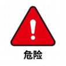
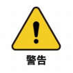

# User Notice
## 1 Introduction
&emsp;&emsp;This chapter details general safety information for personnel who perform installation, maintenance, and repair work on the Elephant robot. Please fully read and understand the contents and precautions in this chapter before handling, installing, and using it.

## 2 Hazard Identification
&emsp;&emsp;The safety of collaborative robots is based on the correct configuration and use of the robots. Moreover, even if all safety instructions are followed, harm or injury to the operator may still occur. Therefore, it is very important to understand the safety hazards of robot use, which is conducive to preventing them before they occur.
&emsp;The following tables 1-1~3 are common safety hazards that may exist in the context of using robots:

 <strong>Table 1-1 Dangerous safety hazards</strong>

|
|
| :--- |
| 1. Personal injury or robot damage caused by incorrect operation during robot handling. |
| 2. Failure to fix the robot as required, such as lack of screws or screws not tightened, insufficient base locking capacity to stably support the robot for high-speed movement, etc., causing the robot to fall over and cause personal injury or robot damage. |
| 3. Failure to configure the correct safety function of the robot, or insufficient installation of safety protection tools, etc., causing the robot's safety function to fail to function, thereby causing danger. |

 <strong>Table 1-2 Warning-level safety hazards</strong>

|
|
| :--- |
| 1. Do not stay in the robot's range of motion when debugging the program. Improper safety configuration may not be able to avoid collisions that may cause personal injury. |
| 2. Connecting the robot to other equipment may cause new dangers, and a comprehensive risk assessment needs to be re-performed. |
| 3. Scratches and punctures caused by sharp surfaces such as other equipment or the robot's end effector in the working environment. |
| 4. The robot is a precision machine, and stepping on it may cause damage to the robot. |
| 5. Failure to remove the clamped object before clamping it in place or turning off the robot's power or air source (not confirming whether the end effector is firm and the clamped object falls due to loss of power) may cause dangers, such as damage to the end effector and injuries to people. |
| 6. The robot has the risk of accidental movement. Do not stand under any axis of the robot under any circumstances! |
| 7. The robot is a precision machine. If it is not placed stably during transportation, it may cause vibration and damage to the internal parts of the robot. |
| 8. Compared with ordinary mechanical equipment, the robot has more degrees of freedom and a larger range of motion. Failure to meet the range of motion may cause unexpected collisions. |

 <strong>Table 1-3 Safety hazards that may cause electric shock</strong>

|
|
| :--- |
| 1. Using non-original cables may cause unknown dangers. |
| 2. Electrical equipment contacting liquids may cause leakage hazards. |
| 3. There may be a risk of electric shock when the electrical connection is wrong. |
| 4. Please be sure to turn off the power of the controller and related devices and unplug the power plug before replacing. If the operation is performed while the power is on, it may cause electric shock or malfunction. |

## 3 Precautions
**The following rules should be followed when using the three-finger dexterous hand:**
* Please distinguish the line sequence according to the line mark. If the line mark is lost, detached, or forgotten, please contact our staff to cooperate in determining the line sequence. If you do not contact our staff, you will be responsible for the damage to the dexterous hand due to the wrong line sequence
* Please do not burn other product drivers or use unofficial recommended methods to burn firmware. If the device is damaged due to the user's personal burning of other firmware, it will not be covered by after-sales service. 
* If the surface of the dexterous hand is stained due to use, it is recommended to wipe it gently with clean water. To avoid coating damage, do not use alcohol solvents to clean the shell and finger sleeves. If the surface is damaged due to the use of alcohol-based cleaners and needs to be repaired or replaced, our company will charge the corresponding repair fee according to the terms of the contract

**If you have any questions or suggestions about the content, you can log in to the official website of Elephant Robotics to submit relevant information:**

https://www.elephantrobotics.com