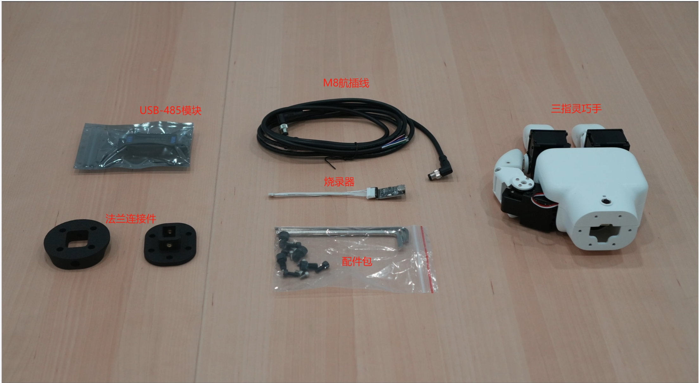

## 首次安装使用
## 1 产品清单

| 名称    | 数量     |
| :----------- | :-------------------------------------- |
| 三指灵巧手    |   1                                |
| USB-485模块   | 1指                                  |
| 烧录器    | 1                                   |
| M8航插线     | 1                                  |
| 配件包  | 1                             |
| 法兰连接件         | 2                               |

## 2 开箱视频
待上传

## 3 注意事项
**使用三指灵巧手时应遵循如下规则：**
* 请根据线标区分线序，如出现线标丢失、脱落、遗忘等情况，请联系我司工作人员，配合确定线序。如不联系我司工作人员，因接错线序，导致灵巧手损坏，后果自负
* 请勿擅自烧录其他产品驱动、或使用非官方推荐方式烧录固件。如因用户个人烧录其他固件导致设备损坏将不在售后服务内。
* 若灵巧手表面有污垢，用清水微微沾湿抹布擦拭即可。请勿用酒精等其他液体擦拭灵巧手的外壳和指套，因为会造成掉漆现象。如因用户用其他液体擦拭灵巧手，导致掉漆的，后果自负