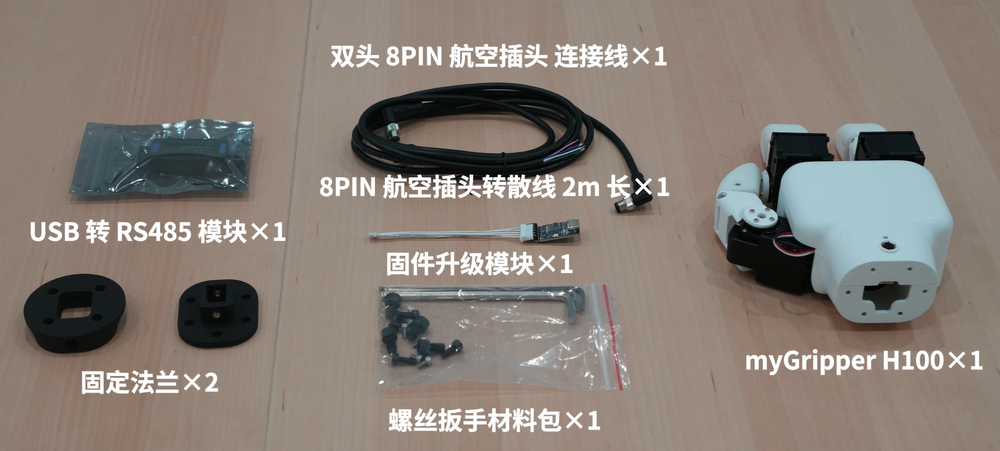

## 首次安装使用
## 1 产品清单

| 名称    | 数量     |
| :----------- | :-------------------------------------- |
| 三指灵巧手    |   1                                |
| USB-485模块   | 1                                 |
| 烧录器    | 1                                   |
| M8航插线     | 1                                  |
| 配件包  | 1                             |
| 法兰连接件         | 2                               |

## 2 开箱视频
待上传

## 3 注意事项
**使用三指灵巧手时应遵循如下规则：**
* 请根据线标区分线序，如出现线标丢失、脱落、遗忘等情况，请联系我司工作人员，配合确定线序。如不联系我司工作人员，因接错线序，导致灵巧手损坏，后果自负
* 请勿擅自烧录其他产品驱动、或使用非官方推荐方式烧录固件。如因用户个人烧录其他固件导致设备损坏将不在售后服务内。
* 灵巧手表面若遇使用导致表面污渍，建议以清水轻拭。为避免涂层损伤，请勿使用酒精类溶剂清洁外壳及指套。若因使用酒精类清洁剂导致表面损伤需维修更换，我司将依据合同条款收取相应维修费用