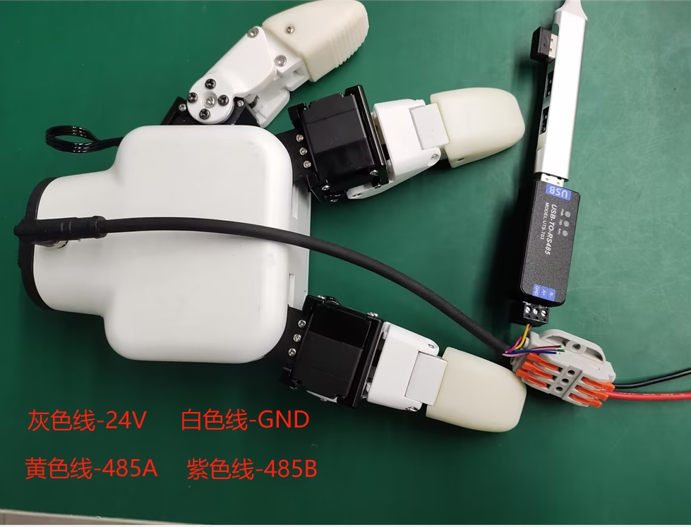
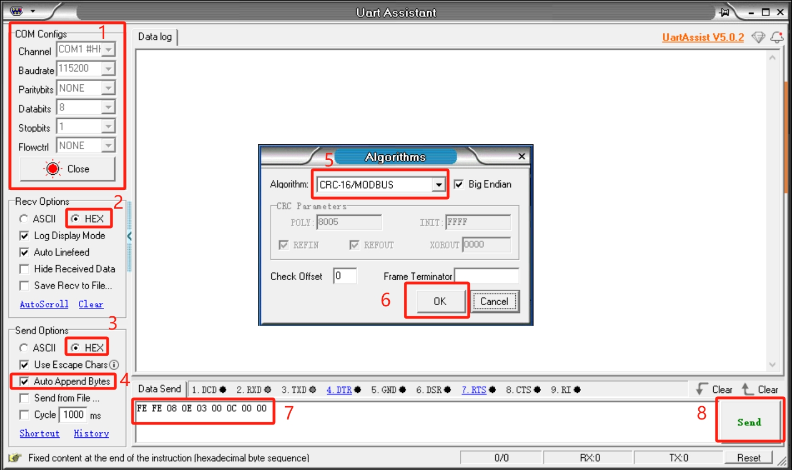

# 基础使用

## 串口控制方法
**USB-485模块接线**：

连接灵巧手端的 24V，GND, 485_A(T/R+,485+) , 485_B(T/R-,485-)共 4 根线，电源为24V直流稳压电源，将模块的 USB 插口插入到电脑的 USB 接口

485A 接入 485 转 USB 模块 A+; 
485B 接入 485 转 USB 模块 B-; 
24V 接入 24V 直流稳压电源正极; 
GND 接入 24V 直流稳压电源负极 

**串口调试助手调试**：

用户可用[UartAssist](https://www.nitwo.com/cn/download/UartAssist.html)串口调试助手，参考下图发送相应的灵巧手指令,CRC校验码无需填写，UartAssist串口调试助手会自动生成。

**灵巧手串口默认配置**
- 灵巧手 ID：14
- 波特率：115200
- 数据位：8
- 停止位：1
- 校验位：无校验位

灵巧手采用自定义协议,一条指令由帧头（2byte）,长度（1byte）,地址码 ID（1byte）,功能码（1byte）,寄存器地址（2byte）,寄存器数据（2*n个byte）,校验码（2byte）,我们以读取灵巧手角度为例

| 帧头    | 长度  | ID  |功能码  |寄存器地址  |寄存器数据/参数 | CRC-16MODBUS校验码  |
| :--- | :--- |:--- |:--- |:--- |:--- |:--- |
|Fe Fe| 08 |0e| 03 |00 0C|00 01|71 01|

**帧头**：254 254  

**长度**：指令长度 08  

**ID**： 0E，可以在设备中修改，默认 ID 为 14 ，0E 代表灵巧手当前 ID 为 14  

**功能码**：识别指令是设置还是获取功能,06（对寄存器进行写操作）/03（对寄存器进行读操作）。  

**寄存器地址**：00 0c 灵巧手功能对应寄存器地址  

**寄存器参数**：00 01 若是读取，只需填写舵机的ID,若是设置，需要填写舵机的ID和写入的参数  

**CRC 校验**：71 01 保证终端设备不去响应那些在传输过程中发生改变的数据,保证系统的安全性和效率,CRC 校验采用 16 位的循环余方法 。将帧头,长度,功能码,寄存器地址,寄存器参数所有16进制直接进行校验得到 71 01 校验码。  

#### 命令总览
- 读取固件主版本号

  指令：fe fe 08 0e 03 00 01 00 00 72 51

  功能码：03 读操作

  参数：无

  返回：fe fe 08 0e 03 00 01 00 01 B2 90

  标注：数据返回 00 01，返回版本号为 1

- 读取固件次版本号

  指令：FE FE 08 0E 03 00 02 00 00 72 A1

  功能码：03 读操作

  参数：无

  返回：FE FE 08 0E 03 00 02 00 01 B2 60

  标注：数据返回 00 01，表示返回版本号为 1

- 设置/读取设备 ID 号
  - 设置
  
      指令：FE FE 08 0E 06 00 03 00 0E 76 BD

      功能码：06 写操作

      参数：00 0E，ID 设置范围（1-254）

      返回：FE FE 08 0E 06 00 03 00 01 72 FD

      标注：成功返回 00 01，失败返回 00 00，设备 ID 修改后,指令中的 ID 也需要修改
      成一样才可以通信

  - 读取

      指令：FE FE 08 0E 03 00 04 00 00 73 41

      功能码：03 读操作

      参数：无

      返回：FE FE 08 0E 03 00 04 00 0E B7 C0

      标注：数据返回 00 0E，表示当前灵巧手 ID 号

- 设置/读取 485 波特率
  - 设置

      指令：FE FE 08 0E 06 00 05 00 00 73 1D

      功能码：06 写操作

      参数：参数 00 00，0-115200，1-1000000，2-57600，3-19200，4-9600，5-4800，
      如设置为 1000000，参数改为 00 01

      返回：FE FE 08 0E 06 00 05 00 01 72 FD

      标注：成功返回 00 01，失败返回 00 00

  - 读取

      指令：FE FE 08 0E 03 00 06 00 00 B3 E0

      功能码：03 读操作

      参数：无

      返回：FE FE 08 0E 03 00 06 00 00 B3 E0

      标注：返回数据 00 00，与设值参数对应波特率的值

- 设置灵巧手使能状态

  指令：FE FE 08 0E 06 00 0A 00 00 B0 EC

  功能码：06 写操作

  参数：00 00， 00 表示断使能， 00 01 表示使能

  返回：FE FE 08 0E 06 00 0A 00 01 70 2D

  标注：成功返回 00 01，失败返回 00 00

- 设置/读取灵巧手角度
  - 设置

      指令：FE FE 0A 0E 06 00 0B 00 01 00 64 FF 39

      功能码：06 写操作

      参数：00 01 00 64，设置舵机1角度为100

      返回：FE FE 08 0E 06 00 0B 00 01 B0 7C

      标注：成功返回 00 01，失败返回 00 00

  - 读取

      指令：FE FE 08 0E 03 00 0C 00 01 71 01

      功能码：03 读操作

      参数：无

      返回：FE FE 08 0E 03 00 0C 00 64 5A C1

      标注：返回数据 00 64，表示当前角度为 100，全开状态

- 设置舵机零位

  指令：FE FE 08 0E 06 00 0D 00 01 B1 9C

  功能码： 06 写操作

  参数：00 01 设置舵机1零位

  返回：FE FE 08 0E 06 00 0D 00 01 B1 9C

  标注：成功返回 00 01，失败返回 00 00

- 读取灵巧手夹持状态

  指令：FE FE 08 0E 03 00 0E 00 00 71 61

  功能码：03 读操作

  参数：无

  返回：FE FE 08 0E 03 00 0E 00 01 B1 A0

  标注：00 01，返回数据 0为正在运动 ,1为停止运动，未检测到夹到物,2为停止运动，检测到夹住物体,3为检测到夹住物体，物体掉落

- 设置/读取舵机 P 值
  - 设置

      指令：FE FE 0A 0E 06 00 0F 00 01 00 64 3F C8

      功能码：06 写操作

      参数：00 01 00 64，设置舵机1 P 值为 100，设置范围（1-254）

      返回：FE FE 08 0E 06 00 0F 00 01 71 3D

      标注：成功返回 00 01，失败返回 00 00
  - 读取

      指令：FE FE 08 0E 03 00 10 00 01 B7 C0
      功能码：03 读操作
      参数：00 01 舵机1
      返回：FE FE 08 0E 03 00 10 00 64 9C 00
      标注：返回数据 00 64，表示当前 P 值为 100

- 设置/读取舵机 D 值
  - 设置

      指令：FE FE 0A 0E 06 00 11 00 01 00 64 3D 60

      功能码：06 写操作

      参数：00 01 00 64，设置舵机1 D 值为 100，设置范围（1-254）

      返回：FE FE 08 0E 06 00 11 00 01 77 5D

      标注：成功返回 00 01，失败返回 00 00

      **若灵巧手出现抖动，可适当增大 D 值**
  - 读取

      指令：FE FE 08 0E 03 00 12 00 01 77 61

      功能码：03 读操作

      参数：00 01 舵机1

      返回：FE FE 08 0E 03 00 12 00 64 5C A1

      标注：返回数据 00 64，表示当前 D 值为 100

- 设置/读取舵机 I 值
  - 设置

      指令：FE FE 0A 0E 06 00 13 00 01 00 00 16 18

      功能码：06 写操作

      参数：00 01 00 00，设置舵机1 I 值为 0，设置范围（1-254）

      返回：FE FE 08 0E 06 00 13 00 01 B7 FC

      标注：成功返回 00 01，失败返回 00 00

  - 读取

      指令：FE FE 08 0E 03 00 14 00 01 76 81

      功能码：03 读操作

      参数：00 01 舵机1

      返回：FE FE 08 0E 03 00 14 00 00 B6 40

      标注：返回数据 00 00，表示当前 I 值为 0

- 设置/读取舵机顺时针可运行误差
  - 设置

      指令：FE FE 0A 0E 06 00 15 00 01 00 03 17 D0

      功能码：06 写操作

      参数：00 01 00 03，设置舵机1的误差值为 3，设置范围（0-16）

      返回：FE FE 08 0E 06 00 15 00 01 B6 1C

      标注：成功返回 00 01，失败返回 00 00
  - 读取

      指令：FE FE 08 0E 03 00 16 00 01 B6 20

      功能码：03 读操作

      参数：00 01 舵机1

      返回：FE FE 08 0E 03 00 16 00 01 B6 20

      标注：返回数据 00 01，表示当前值为 1

- 设置/读取舵机逆时针可运行误差
  - 设置

      指令：FE FE 0A 0E 06 00 17 00 01 00 03 D7 A9

      功能码：06 写操作

      参数：00 01 00 03，设置舵机的误差值为 3，设置范围（0-16）

      返回：FE FE 08 0E 06 00 17 00 01 76 BD

      标注：成功返回 00 01，失败返回 00 00

  - 读取

      指令：FE FE 08 0E 03 00 18 00 01 75 41

      功能码：03 读操作

      参数：00 01 舵机1

      返回：FE FE 08 0E 03 00 18 00 01 75 41

      标注：返回数据 00 01，表示当前值为 1

- 设置/读取舵机最小启动力
  - 设置

      指令：FE FE 0A 0E 06 00 19 00 01 00 18 1D 80

      功能码： 06 写操作

      参数：00 01 00 18 设置舵机1的值为24

      返回：FE FE 08 0E 06 00 19 00 01 B5 DC

      标注：成功返回 00 01，失败返回 00 00
  - 读取

      指令：FE FE 08 0E 03 00 1A 00 01 B5 E0

      功能码：03 读操作

      参数：00 01 舵机1

      返回：FE FE 08 0E 03 00 1A 00 18 7F 21

      标注：返回数据 00 18，表示当前值为 24

- 设置/读取舵机扭矩
  - 设置

      指令：FE FE 0A 0E 06 00 1B 00 01 00 64 3C F8

      功能码： 06 写操作

      参数：00 01 00 64 设置舵机1扭力为 100，参数范围（0-100）

      返回：FE FE 08 0E 06 00 1B 00 01 75 7D

      标注：成功返回 00 01，失败返回 00 00

  - 读取

      指令：FE FE 08 0E 03 00 1C 00 01 B4 00

      功能码：03 读操作

      参数：00 01 舵机1 

      返回：FE FE 08 0E 03 00 1C 01 2C 39 C1

- 设置/读取舵机速度
  - 设置

      指令：FE FE 0A 0E 06 00 20 00 01 00 14 1D 1C

      功能码： 06 写操作

      参数：00 01 00 14 设置舵机1速度为 20，参数范围（1-100）

      返回：FE FE 08 0E 06 00 20 00 01 B8 0C

      标注：成功返回 00 01，失败返回 00 00
  - 读取

      指令：FE FE 08 0E 03 00 21 00 01 78 91

      功能码：03 读操作

      参数：00 01 舵机1

      返回：FE FE 08 0E 03 00 21 00 32 6D D1

      标注：00 32 数据返回为 50

- 设置灵巧手手势
  - 设置

      指令：FE FE 08 0E 06 00 34 01 01 00 35 EC

      功能码： 06 写操作

      参数：01 01 设置手势（0-4），手势闭合程度（0-5）

      返回：FE FE 08 0E 06 00 34 00 01 B8 0C

      标注：成功返回 00 01，失败返回 00 00

- 设置/读取灵巧手角度
  - 设置

      指令：FE FE 12 0E 06 00 2D 00 00 00 00 00 00 00 00 00 00 00 00 00 14 23 FC

      功能码： 06 写操作

      参数：00 00 00 00 00 00 00 00 00 00 00 00 00 14 前面12个字节代表角度（0-100），最后两个字节代表速度 （0-100）

      返回：FE FE 08 0E 06 00 2D 00 01 7B 9D

      标注：成功返回 00 01，失败返回 00 00
  - 读取

      指令：FE FE 08 0E 03 00 32 00 00 7D A1

      功能码：03 读操作

      参数：无

      返回：FE FE 0C 0E 03 00 32 00 00 00 01 00 00 00 00 00 01 00 00 84 74

      标注：00 00 00 01 00 00 00 00 00 01 00 00 数据返回为 [0, 1, 0, 0, 1, 0]