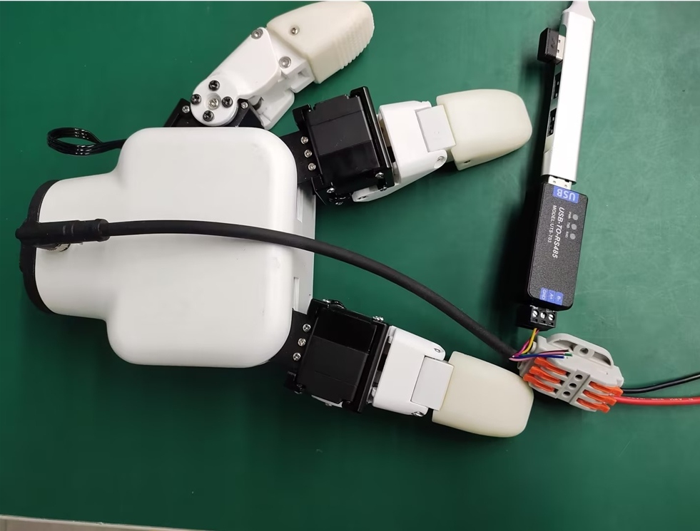

# python development

**USB-485 module wiring**:

Connect the 24V, GND, 485_A (T/R+, 485+), 485_B (T/R-, 485-) of the smart hand end, a total of 4 wires, the power supply is a 24V DC regulated power supply, and insert the USB port of the module into the USB port of the computer



485A connects to the 485 to USB module A+;<br>
485B connects to the 485 to USB module B-;<br>
24V connects to the positive pole of the 24V DC regulated power supply;<br>
GND connects to 24V Negative pole of DC regulated power supply<br>

**Driver library installation**
[Click to download the driver library](https://github.com/elephantrobotics/Myhand)


##### Serial port dependency library installation
Execute the following command in the computer terminal to install the dependency library
```bash
pip install pyserial
```
## API description

### get_gripper_firmware_version()

- **Function:** Get the gripper firmware major version number
- **Parameter:** None
- **Return:** `(int)` Firmware major version number

### get_gripper_modified_version()

- **Function:** Get the gripper firmware minor version number
- **Parameter:** None
- **Return:** `(int)` Firmware minor version number

### get_gripper_gripper_Id()

- **Function:** Get the gripper ID
- **Parameter:** None
- **Return:** `(int)` Gripper ID

### get_gripper_gripper_baud()

- **Function:** Get the gripper baud rate
- **Parameter:** None
- **Return:** `(int)` 0-5
  - `0`: 115200
  - `1`: 1000000
  - `2`: 57600
  - `3`: 19200
  - `4`: 9600
  - `5`: 4800

### get_gripper_joint_angle(id)

- **Function:** Get the current position data of the gripper
- **Parameter:** `id`: `(int)` Gripper joint ID, value range `1-6`
- **Return:** `(int)` Current position data of the gripper joint ID

### get_gripper_status()

- **Function:** Get the current status of the gripper
- **Parameter:** None
- **Return:** `(int)` 0-3
  - `0`: Moving
  - `1`: Stopped moving, no object was detected
  - `2`: Stopped moving, object was detected
  - `3`: After the object was detected, the object fell

### get_gripper_joint_speed(id)

- **Function:** Get the current speed of the gripper joint ID
- **Parameter:** `id`: `(int)` Gripper joint ID, value range `1-6`
- **Return:** `(int)` Current speed of the gripper joint ID

### get_gripper_joint_P(id)

- **Function:** Get the P value of the PID of the gripper joint ID
- **Parameter:** `id`: `(int)` Gripper joint ID, value range `1-6`
- **Return:** `(int)` The P value of the PID of the gripper joint ID

### get_gripper_joint_I(id)

- **Function:** Get the I value of the PID of the gripper joint ID
- **Parameter:** `id`: `(int)` Gripper joint ID, value range `1-6`
- **Return:** `(int)` The I value of the PID of the gripper joint ID

### get_gripper_joint_D(id)

- **Function:** Get the D value of the PID of the gripper joint ID

- **Parameter:** `id`: `(int)` Gripper joint ID, value range `1-6`
- **Return:** `(int)` The D value of the PID of the gripper joint ID

### get_gripper_joint_cw(id)

- **Function:** Get the clockwise runnable error of the gripper joint ID

- **Parameter:** `id`: `(int)` Gripper joint ID, value range `1-6`
- **Return:** `(int)` The clockwise runnable error of the gripper joint ID

### get_gripper_joint_cww(id)

- **Function:** Get the counterclockwise runnable error of the gripper joint ID

- **Parameter:** `id`: `(int)` Gripper joint ID, value range `1-6`
- **Return:** `(int)` Anti-clockwise runnable error of the gripper joint ID

### get_gripper_joint_mini_pressure(id)

- **Function:** Get the minimum starting force of the gripper joint ID

- **Parameter:** `id`: `(int)` Gripper joint ID, value range `1-6`
- **Return:** `(int)` Minimum starting force of the gripper joint ID

### get_gripper_joint_mini_pressure(id)

- **Function:** Get the minimum starting force of the gripper joint ID

- **Parameter:** `id`: `(int)` Gripper joint ID, value range `1-6`
- **Return:** `(int)` Minimum starting force of the gripper joint ID

### get_gripper_angles()

- **Function:** Get the angles of the 6 joints of the gripper

- **Parameter:** `id`: `(int)` Gripper joint ID, value range `1-6`
- **Return:** `(list)` Angles of the 6 joints of the gripper

### set_gripper_Id(value)

- **Function:** Set the gripper ID number
- **Parameter:**
  - `value`: `(int)` Gripper ID, value range `1-254`
- **Return:** `(int)` 0-1
  - `0`: Failed
  - `1`: Successful

### set_gripper_baud(value)

- **Function:** Set the gripper baud rate
- **Parameter:**
  - `value`: `(int)` Gripper baud rate, value range `0-5`
    - `0`: 115200
    - `1`: 1000000
    - `2`: 57600
    - `3`: 19200
    - `4`: 9600
    - `5`: 4800
- **Return:**`(int)` 0-1
  - `0`: Failed
  - `1`: Success

### set_gripper_enable(value)

- **Function:** Set the gripper enable state
- **Parameter:**
  - `value`: `(int)` Enable state, value range `0-1`
    - `0`: Disable
    - `1`: Enable
- **Return:**`(int)` 0-1
  - `0`: Failed
  - `1`: Success

### set_gripper_joint_calibration(id)

- **Function:** Set the gripper joint ID zero calibration
- **Parameter:** `id`: `(int)` Gripper joint ID, value range `1-6`
- **Return:**`(int)` 0-1
  - `0`: Failed
  - `1`: Success

### set_gripper_joint_P(id,value)

- **Function:** Set the P value of the PID of the gripper joint ID

- **Parameters:**
  - `id`: `(int)` Joint ID, value range `1-6`
  - `value`: `(int)` P value, value range `0-254`
- **Return:** `(int)` 0-1
  - `0`: Failed
  - `1`: Success

### set_gripper_joint_I(id,value)

- **Function:** Set the I value of the PID of the gripper joint ID

- **Parameters:**
  - `id`: `(int)` Joint ID, value range `1-6`
  - `value`: `(int)` I value, value range `0-254`
- **Return:** `(int)` 0-1
  - `0`: Failed
  - `1`: Success

### set_gripper_joint_D(id,value)

- **Function:** Set the D value of the PID of the gripper joint ID

- **Parameters:**
  - `id`: `(int)` Joint ID, value range `1-6`
  - `value`: `(int)` D value, value range `0-254`
- **Return:** `(int)` 0-1
  - `0`: Failed
  - `1`: Success

### set_gripper_joint_cw(id,value)

- **Function:** Set the clockwise runnable error of the gripper joint ID

- **Parameters:**
  - `id`: `(int)` Joint ID, value range `1-6`
  - `value`: `(int)` Error, value range `0-16`
- **Return:** `(int)` 0-1
  - `0`: Failed
  - `1`: Success

### set_gripper_joint_cww(id,value)

- **Function:** Set the counterclockwise runnable error of the gripper joint ID

- **Parameters:**
  - `id`: `(int)` Joint ID, value range `1-6`
  - `value`: `(int)` Error, value range `0-16`
- **Return:** `(int)` 0-1
  - `0`: Failed
  - `1`: Success

### set_gripper_joint_mini_pressure(id,value)

- **Function:** Set the minimum starting force of the gripper joint ID

- **Parameters:**
  - `id`: `(int)` Joint ID, value range `1-6`
  - `value`: `(int)` Minimum starting force, value range `0-254`
- **Return:** `(int)` 0-1
  - `0`: Failed
  - `1`: Success

### set_gripper_joint_torque(id,value)

- **Function:** Set the torque of the gripper joint ID
- **Parameters:**
  - `id`: `(int)` Joint ID, value range `1-6`
  - `value`: `(int)` Torque, value range `0-100`
- **Return:** `(int)` 0-1
  - `0`: Failed
  - `1`: Success

### set_gripper_joint_speed(id,speed)

- **Function:** Set the speed of the gripper joint ID
- **Parameters:**
  - `id`: `(int)` Joint ID, value range `1-6`
  - `speed`: `(int)` Speed, value range `1-100`
- **Return:** `(int)` 0-1
  - `0`: Failed
  - `1`: Success

### set_gripper_angles(angles,speed)

- **Function:** Set the angle of all joints of the gripper
- **Parameters:**
  - `angles`: `(list)` 6 joint angles, each joint angle has a value range of `0-100`
  - `speed`: `(int)` speed, value range of `1-100`
- **Return:** `(int)` 0-1
  - `0`: Failed
  - `1`: Successful

### set_gripper_action(value)

- **Function:** Set the gripper pinching action
- **Parameters:**
  - `value`: `(int)` action, value range of `0-3`
    - `0`: Index finger and thumb pinching
    - `1`: Middle finger and thumb pinching
    - `2`: Three-finger gripping
    - `3`: Two-finger gripping
- **Return:** `(int)` 0-1
  - `0`: Failed
  - `1`: Success

### set_gripper_pose(pose,value,flag)

- **Function:** Set the gripper pinching action and opening and closing degree

- **Parameters:**
  - `pose`: `(int)` Action, value range `0-4`
    - `0`: All joints return to zero
    - `1`: Index finger and thumb pinching
    - `2`: Middle finger and thumb pinching
    - `3`: Middle finger and index finger pinching
    - `4`: Three-finger pinching
  - `value`: `(int)` Opening and closing degree, value range `0-15`, closing degree, the higher the level, the closer it is
  - `flag`: `(int)` Idle flag, when flag 1, the idle finger can be freely controlled

- **Return:** `(int)` 0-1
  - `0`: Failure
  - `1`: Success

#### Testing Procedure


```python
from MyHand import MyGripper_H100
import time
if __name__=="__main__":
    hand=MyGripper_H100("COM8")
    hand.set_gripper_pose(0,0)
    time.sleep(2)
    hand.set_gripper_pose(1,5)
    time.sleep(5)
    hand.set_gripper_pose(2,5)
    time.sleep(5)
    hand.set_gripper_pose(3,5)
    time.sleep(5)
    hand.set_gripper_pose(4,15)
    time.sleep(5)
    hand.set_gripper_pose(0,0)
    time.sleep(2)
```
#### Effect display


