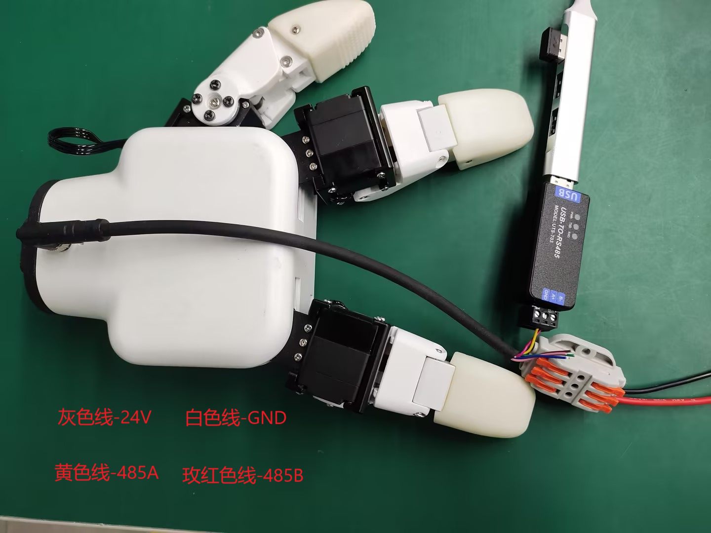

# python USB-485库控制

## 硬件连接

连接灵巧手端的 24V，GND, 485_A(T/R+,485+) , 485_B(T/R-,485-)共 4 根线，电源为24V直流稳压电源，将模块的 USB 插口插入到电脑的 USB 接口



485A 接入 485 转 USB 模块 A+;<br>
485B 接入 485 转 USB 模块 B-;<br>
24V 接入 24V 直流稳压电源正极;<br>
GND 接入 24V 直流稳压电源负极<br>

## 软件安装
**驱动库安装**
[点击下载驱动库](https://github.com/elephantrobotics/Myhand)


##### 串口依赖库安装
在电脑终端执行下面命令，安装依赖库
```bash
pip install pyserial
```

## 案例程序

```python
from MyHand import MyGripper_H100
import time
if __name__=="__main__":
    hand=MyGripper_H100("COM8")
    hand.set_gripper_pose(0,0)
    time.sleep(2)
    hand.set_gripper_pose(1,5)
    time.sleep(5)
    hand.set_gripper_pose(2,5)
    time.sleep(5)
    hand.set_gripper_pose(3,5)
    time.sleep(5)
    hand.set_gripper_pose(4,15)
    time.sleep(5)
    hand.set_gripper_pose(0,0)
    time.sleep(2)
```
## 效果展示


