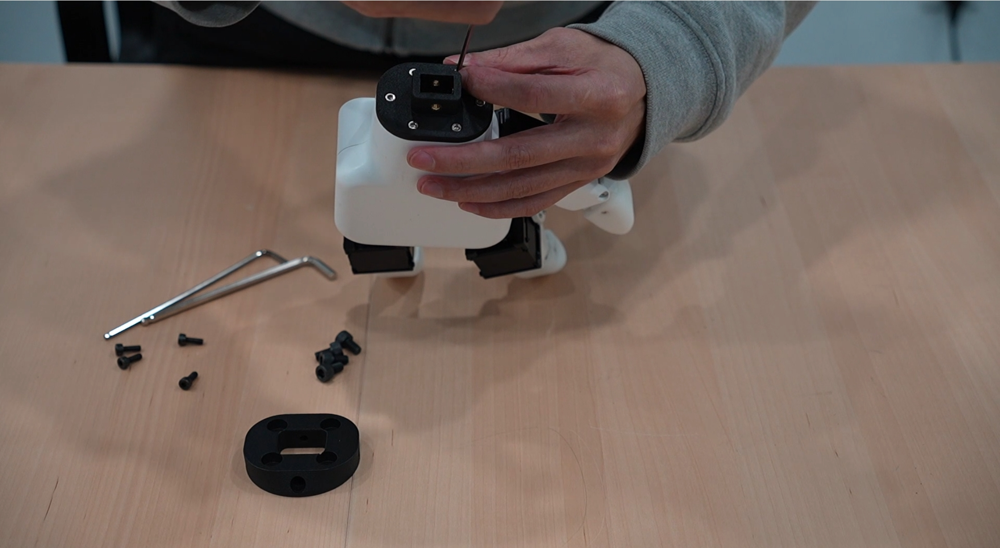
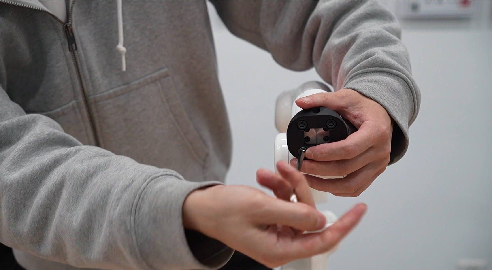
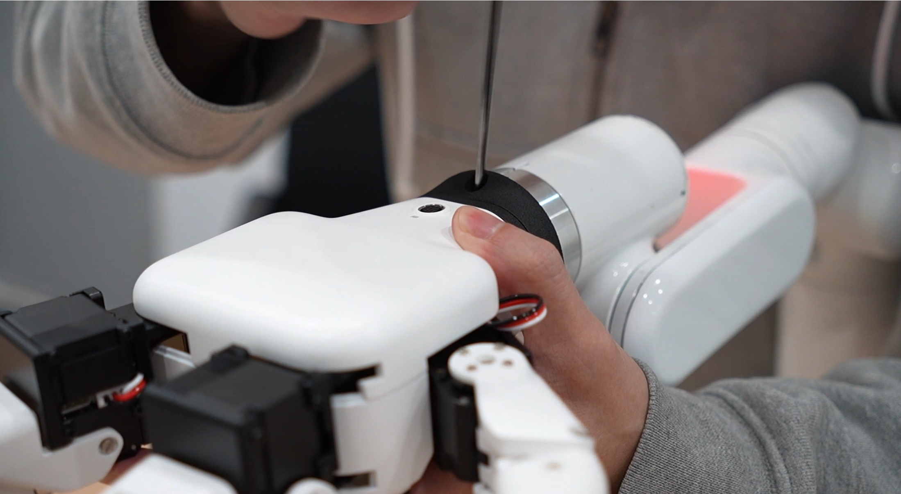
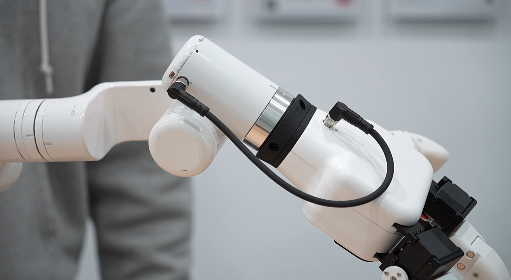

# 水星A1控制

## 硬件安装
先将连接件安装到灵巧手上



然后将另一个连接件安装到机械臂末端法兰上



之后再将灵巧手安装到末端连接法兰上，上下左右4个孔位都用螺丝固定



最后用M8航插线连接拧紧



## 软件安装
依赖库安装
```bash
pip install pymycobot --upgrade
```

## 案例程序

```python
from pymycobot import Mercury
import time
me=Mercury()
me.set_hand_gripper_pinch_action_speed_consort(14,4,1)
me.power_on()
target_angles=[
[-11.326, 0.245, -0.909, -122.652, 5.459, 167.24, 0.38],
[-11.327, 13.361, -0.902, -122.646, 5.46, 167.24, 0.381],
[-11.319, 6.808, 16.44, -117.003, 5.461, 167.24, 0.39],
[-11.324, 18.251, 16.324, -117.001, 5.461, 167.241, 0.39]

]

def wait():
    time.sleep(0.2)
    while me.is_moving()==1:
        pass

for i in range(len(target_angles)):
    me.send_angles(target_angles[i],20)
    wait()
    if i ==1:
        me.set_hand_gripper_pinch_action_speed_consort(14,4,8)
        time.sleep(2)
        me.send_angles(target_angles[i-1],20)
        wait()
    elif i ==3:
        me.set_hand_gripper_pinch_action_speed_consort(14,4,1)
        time.sleep(2)
        me.send_angles(target_angles[i-1],20)
        wait()
```

## 效果展示

